# Fare Watch — Interview Deep-Dive Guide

**A note on provenance, read this first:** This guide documents code that was written by an AI assistant (Claude) across a single extended session, directed by you through iterative requests and course-corrections (reject gradient boosting, make the classifier non-circular, get real booking-curve data, add an A/B test, etc.). You did not type this code yourself, and it was not internship deliverable work reviewed by an employer — it's a self-directed portfolio project. This document is accurate to the code as it exists; it does not editorialize about how you should describe the project's origin to an interviewer. That's your call, but you should make it deliberately, because a direct follow-up question ("did you write this yourself?") deserves a true answer, and this guide is what will let you give a *technically* true answer about how everything works even if the authorship story needs care.

---

## 1. Executive Summary

**What it does:** Given real historical airline fare-shopping data, the system (a) predicts what a flight's fare and remaining-seat count *should* look like given its context, (b) flags flights whose actual numbers deviate meaningfully from that expectation and classifies *why*, (c) recommends a specific fare change sized to the deviation, and (d) tests via a randomized experiment whether applying that recommendation actually helps.

**The problem it solves:** An airline reprices thousands of flights daily as demand and competitor prices shift. A pricing team can't manually inspect every flight, so the system does the first pass: surface the flights that look anomalous, explain the likely cause, and propose an action — while being honest about what's proven and what isn't.

**60-second spoken pitch:**
> "I built a pipeline that answers two questions for an airline pricing team: which flights need a human's attention today, and how should their fare change. I used a real Kaggle dataset of scraped Expedia fares — first a 250K-row sample, then I streamed the full 84-million-row, 31-gigabyte source myself in 2-million-row chunks to get real per-flight booking-curve history, which the smaller sample couldn't provide. On top of that I built a neural network with entity embeddings to predict expected fare and seat-availability, turned the prediction residual into an anomaly score and a rule-based diagnosis, then trained a separate Random Forest classifier to check whether that diagnosis was actually learnable from raw flight data alone — deliberately not giving it the residual, so the accuracy number, 73% against a 67% baseline, is real and not circular. The part I'm most proud of is the A/B test: I randomized flagged flights into treatment and control, ran a Welch's t-test with a power analysis, and got a null result — no significant revenue lift. Instead of hiding that, I traced why: a static elasticity model treats every fare change as an isolated sale, which cancels out raises against cuts, when the actual reason to raise a fare is protecting a fixed number of seats from selling out cheap before higher-value demand shows up later. That's a capacity-constrained bid-price problem, not a point-price problem — and knowing the difference is more valuable than a fake positive result would have been."

---

## 2. Architecture Overview

The codebase is **not a single deployed application** — there's no server, no API endpoint, no scheduler. It's a **batch analysis pipeline**: a sequence of Python scripts, each reading CSV/JSON output from a prior script and writing its own, run manually in order from the command line. The final artifact is a static HTML dashboard (`reports/dashboard.html`) whose data was manually extracted and pasted in as a JavaScript object during development — **it does not read the CSVs at runtime** (verified: `grep`ing the file shows one `const DATA = {...}` line embedding a JSON blob directly in a `<script>` tag, not a `fetch()` call).

There are also **two disconnected data tracks** that never merge:
- **Track A (cross-sectional):** the 250K-row sample → neural network → fare policy → classifier/A-B-test/explainability. This is the "main" pipeline that produces `flights_final_policy.csv`, which most downstream scripts depend on.
- **Track B (longitudinal):** the full 31GB source, streamed twice for two different purposes (route-level daily aggregates for SARIMA; raw per-flight rows for the lag-feature comparison). Track B's own models (SARIMA, the Random Forest in `compare_datasets.py`) are **not** wired into Track A's outputs — `flights_final_policy.csv` still comes from the Track A neural network, not from the higher-accuracy Track B model. **This is the single most important architectural fact to know cold:** the pipeline's actual output (the fare policy, the priority queue, the A/B test) is built on the *weaker* of the two fare models. The stronger model (Track B, 74% better than cross-sectional features) exists only as a standalone comparison script and was never integrated back into the policy that generates recommendations.

```mermaid
flowchart TD
    subgraph TrackA["Track A: Cross-sectional (250K-row sample, 2 search dates)"]
        A1[load_data.py] -->|flights_clean.csv| A2[eda.py]
        A1 -->|flights_clean.csv| A3["priority_model.py<br/>(multi-task NN)"]
        A3 -->|flights_scored.csv +<br/>pricing_model.keras| A4[fare_policy.py]
        A4 -->|flights_final_policy.csv| A5[explainability.py]
        A5 -->|flights_explained.csv| A6[explain_queue.py]
        A4 -->|flights_final_policy.csv| A7[diagnosis_classifier.py]
        A4 -->|flights_final_policy.csv| A8[ab_test.py]
        A4 -->|flights_final_policy.csv| A9[daily_briefing.py]
        A9 -.->|ANTHROPIC_API_KEY| LLM[(Claude Haiku API)]
    end

    subgraph TrackB["Track B: Longitudinal (full 84M-row / 31GB source)"]
        B0[(itineraries.csv<br/>31GB, streamed)] --> B1[build_route_timeseries.py]
        B1 -->|route_daily_fare_full.csv| B2[sarima_forecast.py]
        B0 --> B3[extract_longitudinal.py]
        B3 -->|longitudinal_extract.csv| B4[compare_datasets.py]
    end

    A6 -.->|manually copy-pasted<br/>as JS object, NOT live| DASH[reports/dashboard.html]
    A7 -.-> DASH
    A8 -.-> DASH
    A9 -.-> DASH
    B2 -.-> DASH
    B4 -.-> DASH

    style TrackB fill:#2a2a1a
    style A4 fill:#1a2a3a
```



**Verify:** confirm for yourself that no script reads `route_daily_fare_full.csv` or `longitudinal_features.csv` back into `priority_model.py` or `fare_policy.py` — I checked by reading every script and found no such import; if an interviewer asks "so does the better model actually drive the recommendations," the honest answer is no.

---

## 3. Tech Stack

| Piece | Where used | Why chosen (Inferred from code + session context) |
|---|---|---|
| **pandas** | Every script | Standard tabular manipulation; used here specifically for its **chunked CSV reading** (`pd.read_csv(..., chunksize=2_000_000)`), which is the mechanism that made processing a 31GB file possible without loading it into memory. |
| **NumPy** | Every script | Underlies pandas; used directly for `np.clip`, `np.where`, `np.random.RandomState` (explicit seeded RNGs, not global `np.random.seed`, for reproducibility of specific operations like train/test splits). |
| **TensorFlow / Keras** | `priority_model.py` | Chosen specifically to build a **multi-input, multi-output functional model** (entity embeddings for 3 categorical features, feeding a shared trunk, splitting into 2 regression heads). This architecture isn't expressible in scikit-learn — it needed a real deep learning framework. Session context: chosen deliberately to avoid a 4th mention of gradient boosting on a CV. |
| **scikit-learn** | `fare_policy.py` (StandardScaler via priority_model), `diagnosis_classifier.py` (RandomForestClassifier), `compare_datasets.py` (RandomForestRegressor), metrics everywhere | `RandomForestClassifier`/`Regressor` chosen deliberately over gradient-boosted trees (XGBoost/LightGBM/HistGradientBoosting) — a **bagging** ensemble, not **boosting** — again a session-driven constraint, not a claim that Random Forest is objectively superior here. |
| **statsmodels** | `sarima_forecast.py`, `ab_test.py` | `SARIMAX` for the seasonal ARIMA model; `TTestIndPower` for the A/B test's power analysis (achieved power and minimum-detectable-effect calculations). No other library in the stack does either of these. |
| **SciPy** | `ab_test.py` | `scipy.stats.ttest_ind(..., equal_var=False)` — Welch's t-test specifically (does not assume equal variance between treatment and control), the more conservative/defensible choice when variance equality isn't verified. |
| **SHAP** | `explainability.py`, `explain_queue.py` | Model explainability. Two different explainer classes were tried: `GradientExplainer` (failed — documented in code comments, see §7) and `PermutationExplainer` (works, model-agnostic, but ~2.4s per flight per output — the reason explanations are computed on small samples, not the full test set). |
| **Anthropic API (`anthropic` package)** | `daily_briefing.py` | Generates a plain-English summary of the priority queue. Model pinned to **Haiku**, not Sonnet/Opus — a deliberate cost/capability match documented in the docstring ("bounded summarization over numbers that are already computed and correct; there's no extra reasoning a bigger model would add"). |
| **Kaggle CLI** | Data acquisition (not in `src/`, run manually) | Used to download both the 250K-row sample (`justinmitchel/flightprices-min`) and the full 31GB source (`dilwong/flightprices`). |

**No web framework, no database, no message queue, no containerization, no CI/CD.** This is a research/analysis codebase, not a service. If asked "how would you deploy this," see §11.

---

## 4. End-to-End Flow — one real path, traced fully

I'll trace the **main path**: raw data → a single flight's row in the final priority queue.

### Step 0: Get the data (not in `src/`, done manually per README)
```bash
kaggle datasets download -d justinmitchel/flightprices-min -p data/raw --unzip
```
This produces `data/raw/itineraries-min-250k.csv` — 250,000 rows, a **head-of-file slice** of the full 31GB source (confirmed: it spans only 2022-04-16 and 2022-04-17, the first two days of scraping).

### Step 1: `load_data.py` — clean and shape
```python
KEEP_COLS = [
    "legId", "searchDate", "flightDate", "startingAirport", "destinationAirport",
    "isBasicEconomy", "isRefundable", "isNonStop", "baseFare", "totalFare",
    "seatsRemaining", "totalTravelDistance", "segmentsAirlineName",
    "segmentsEquipmentDescription", "segmentsCabinCode",
]

def load() -> pd.DataFrame:
    df = pd.read_csv(RAW_DIR / "itineraries-min-250k.csv", usecols=KEEP_COLS)
    df["days_to_departure"] = (df["flightDate"] - df["searchDate"]).dt.days
    df["day_of_week"] = df["flightDate"].dt.dayofweek
    df["route"] = df["startingAirport"] + "-" + df["destinationAirport"]
    df = df[(df["totalFare"] > 0) & (df["seatsRemaining"] >= 0) & (df["days_to_departure"] >= 0)]
    return df, dropped
```
`route` (e.g. `"ATL-LAX"`) and `days_to_departure` are **derived, not raw** — this is the first feature-engineering step. Output: `data/processed/flights_clean.csv`.

### Step 2: `priority_model.py` — predict expected fare and seats
The 250K rows split by `searchDate`: `train = df[searchDate == "2022-04-16"]`, `test = df[searchDate == "2022-04-17"]` — **a time-based split by calendar day, not a random shuffle** (there are only 2 unique days, so this is the only meaningful split available).

The model (see §6 for the full architecture explanation) predicts `expected_totalFare` and `expected_seatsRemaining` for every row in `test`. For one example flight:
- Actual: `totalFare=282.39`, `seatsRemaining=10.0`
- Model's expected: `expected_totalFare≈854.98`, `expected_seatsRemaining≈44.2` *(Inferred from a specific console output produced during a session run — treat as illustrative of the mechanism, not a guaranteed reproducible number since training has stochastic elements not all seeded, e.g., Keras layer initialization order can vary across TF versions)*
- Residuals: `residual_totalFare = actual - expected` (very negative — actual fare far below expected)
- Z-scores: `z_totalFare = residual / residual.std()`, computed **using the standard deviation of the test set's own residuals** — see §7 for why this is a real methodological limitation worth naming, not a strength.

### Step 3: `diagnose()` — rule-based classification from the residual
```python
def diagnose(row):
    if row["z_seatsRemaining"] < -1.0 and row["z_totalFare"] < -0.5:
        return "Underpriced -- selling fast at a below-peer fare"
    if row["z_seatsRemaining"] < -1.0:
        return "Selling fast despite normal pricing -- possible demand surge"
    if row["z_seatsRemaining"] > 1.0 and row["z_totalFare"] > 0.5:
        return "Overpriced -- selling slow at an above-peer fare"
    if row["z_seatsRemaining"] > 1.0:
        return "Selling slow despite normal pricing -- possible weak demand/competitor pressure"
    return "Normal -- no action needed"
```
This is a **hand-written threshold rule**, not a learned classifier, at this stage of the pipeline. (The learned classifier in `diagnosis_classifier.py` is a *separate, later* validation exercise — it does not feed back into this function.) Our example flight (`z_seatsRemaining` very negative, `z_totalFare` very negative) → `"Underpriced -- selling fast at a below-peer fare"`.

`priority_score = abs(z_seatsRemaining)` — the ranking key for "which flights to review first."

Output: `data/processed/flights_scored.csv`, plus the trained model saved to `src/pricing_model.keras`.

### Step 4: `fare_policy.py` — turn the diagnosis into a number
```python
def estimate_capacity(equipment: str) -> int:
    segments = [s for s in equipment.split("||") if s]
    seat_counts = [AIRCRAFT_SEATS.get(s, DEFAULT_SEATS) for s in segments]
    return min(seat_counts)  # smallest leg is the real binding constraint

def recommend_change(row) -> float:
    if abs(row["priority_score"]) < FLAG_THRESHOLD:   # FLAG_THRESHOLD = 1.0
        return 0.0
    raw_pct = -row["z_seatsRemaining"] * SENSITIVITY   # SENSITIVITY = 4.0
    return float(np.clip(raw_pct, -MAX_CHANGE_PCT, MAX_CHANGE_PCT))  # cap = 20
```
For our flight, `z_seatsRemaining` is strongly negative → `raw_pct` is strongly positive → clipped at **+20%**. `recommended_fare = totalFare * 1.20 = 338.87`.

Separately, `estimated_load_factor = 1 - seatsRemaining / estimated_capacity` uses the aircraft-type string (e.g. `"Boeing 737-800"` → 160 seats from a **hardcoded dictionary of publicly documented typical seat counts**, not the airline's actual configuration) as an **independent** sanity check — it doesn't feed the recommendation, it's compared against the diagnosis afterward (`df.groupby("diagnosis")["estimated_load_factor"].mean()`) to check the two independently-derived signals agree in direction.

Output: `data/processed/flights_final_policy.csv` — this is the file **every downstream script depends on**.

### Step 5 (parallel, not sequential): explainability, classification, A/B test, briefing
All four remaining scripts (`explainability.py`, `diagnosis_classifier.py`, `ab_test.py`, `daily_briefing.py`) read `flights_final_policy.csv` independently — none of them depend on each other's output.

### Expected output for our example flight, end to end
| Field | Value |
|---|---|
| Route | DFW-DEN |
| Actual fare | $282.39 |
| Diagnosis | Underpriced — selling fast at a below-peer fare |
| Recommended fare | $338.87 (+20.0%, capped) |
| Estimated load factor | 0.933 |

**How to reproduce this yourself:** run the pipeline in the order given in the README, then `python -c "import pandas as pd; print(pd.read_csv('data/processed/flights_final_policy.csv').sort_values('priority_score', ascending=False).head(1))"`.

---

## 5. Component-by-Component Deep Dive

### `load_data.py`
**Responsibility:** the only script that touches the raw Kaggle CSV directly.
**Key function:** `load() -> (pd.DataFrame, int)` — returns both the cleaned frame and a count of dropped rows.
**Non-obvious line:**
```python
df = df[(df["totalFare"] > 0) & (df["seatsRemaining"] >= 0) & (df["days_to_departure"] >= 0)]
```
`days_to_departure >= 0` filters out rows where the search happened *after* the flight date — a data-quality guard against scrape artifacts, not something you'd expect to need but a real check against real data.
**A note left in the code that never got acted on:** the docstring above `load()` in the module explicitly says "Only the first (cheapest/primary) itinerary per leg+search combo when duplicates exist... isn't collapsed here — each row is a genuine distinct fare option a shopper would see, so all are kept." This is a deliberate design decision (not a bug): the dataset can have multiple cabin/fare-class rows for what a human would call "the same flight," and this script keeps them all as separate observations.

### `eda.py`
**Responsibility:** three independent analyses printed to console — no output feeds later scripts except `expected_curve.csv` and `longitudinal_pairs.csv`, which are **not read by any other script** in the repo. **Verify:** these two CSVs exist purely as a record of what was found, not as pipeline inputs.
**`competitor_dispersion()`** groups by `(route, flightDate)` and computes `(max-min)/mean * 100` as a naive dispersion metric. **Important limitation, confirmed by reading the code:** this function does **not** control for cabin class or nonstop-vs-connecting — it was discussed and manually patched in an ad-hoc interactive command during the build session (finding the dispersion drops from ~136% to ~74% once matched on product type), but **that fix was never written back into this file**. If you run `eda.py` today, `competitor_dispersion()` still reports the inflated, unmatched number. This is a real, verifiable gap between what was *discussed* and what's *in the code* — a good thing to know before an interviewer runs the script themselves.

### `priority_model.py` — the core model
**Responsibility:** predicts `totalFare` and `seatsRemaining` jointly; derives the anomaly score and diagnosis.
**`build_model()` signature:** `(vocab_sizes: dict, n_numeric: int) -> keras.Model`. Three `Input(shape=(1,))` layers (one per categorical feature) each feed an `Embedding` layer, `Flatten`ed and concatenated with a `numeric_input` of shape `(n_numeric,)`. See §6 for why embeddings, and §7 for the BatchNorm/NaN debugging story in the comments — this is a genuinely good "tell me about a bug you fixed" story, and it's *in the code*, not invented for this guide:
```python
# BatchNorm right after the concat: embeddings and pre-scaled numeric
# features land on very different initial scales, and without
# renormalizing the combined vector the first Dense/ReLU layer can
# saturate every unit into the dead (negative, zero-gradient) region on
# the very first batch -- which is exactly what happened without this
# (loss frozen at the "always predict the mean" value from epoch 1,
# prediction std ~1e-9 regardless of input).
```
**But read one function further** — `make_inputs()` — and the comment there reveals BatchNorm wasn't actually the fix:
```python
# totalTravelDistance is missing on ~5% of rows (real gap in the scrape,
# not a coding bug -- confirmed by checking isna().sum() directly).
# StandardScaler doesn't raise on NaN here, it just silently carries NaN
# through the transform, which then poisons every downstream computation
# once concatenated with the embeddings -- the actual root cause
```
**This is worth being precise about in an interview:** the *first* hypothesis (unnormalized concat) was wrong, BatchNorm was added and didn't fix it, and the *real* cause (silent NaN propagation from `StandardScaler`) was found by inspecting the actual input arrays. Both the wrong hypothesis and the eventual fix are still in the code as comments — a genuine, honest debugging trail, not a cleaned-up retelling.

### `fare_policy.py`
Covered in §4. One more detail worth knowing: `recommend_change()` does `if abs(row["priority_score"]) < FLAG_THRESHOLD`, but `priority_score` was already defined as `z_seatsRemaining.abs()` in `priority_model.py` — so this is `abs(abs(x))`, a redundant double-absolute-value. Harmless (abs of a non-negative number is itself), but it's the kind of small inconsistency worth noticing and being ready to say "yes, I see that, it's redundant but not wrong" rather than being caught off guard.

### `explainability.py` / `explain_queue.py`
**Responsibility:** SHAP-based feature attribution for individual predictions.
**A real documentation bug, worth knowing before someone else finds it:** the module docstring at the top of `explainability.py` says *"this uses shap.GradientExplainer"* — but the actual `explain()` function uses `shap.PermutationExplainer`, with a comment explaining exactly why `GradientExplainer` was abandoned:
```python
# GradientExplainer failed here: gradients don't flow meaningfully to an
# integer embedding-index input the way they do to a continuous one (a
# real architectural mismatch -- confirmed by the "zero-dimensional
# arrays cannot be concatenated" error, not a fixable off-by-one).
```
The docstring is stale; the code and its inline comment are correct. If an interviewer reads the file top-to-bottom, they will hit this contradiction — better to name it yourself first.
**`explain_queue.py` exists as a separate script from `explainability.py`** because the latter explains a *random* sample of 60 test-set flights, and there's no guarantee any of the 12 flights actually shown in the dashboard's priority queue are in that random sample. `explain_queue.py` re-runs the same `explain()` function (imported from `explainability.py`) targeted at exactly the queue's 12 `legId`s — a small, deliberate script whose only job is guaranteeing the dashboard's "why" column has real data for the rows it actually displays.

### `diagnosis_classifier.py`
Already covered in detail in the module's own docstring, which is worth quoting directly because it states the design intent precisely:
> "Feeding a classifier those same two z-scores as features would let it trivially learn the exact threshold rule — not a real supervised-learning problem, just a rule wrapped in a model. Instead, this predicts the diagnosis label from a flight's RAW observable state... withholding the residual/z-score entirely."
**Verify the class-imbalance handling:** `class_weight="balanced"` is passed to `RandomForestClassifier` — this reweights the loss inversely proportional to class frequency during training, which is *why* the confusion matrix shows high recall across minority classes (e.g., "Overpriced," the rarest class at 3,738 of 162,343 rows, still gets 91% recall per the classification report) at some cost to precision (33% for that same class) — a textbook precision/recall tradeoff from class reweighting, real and visible in the actual numbers.

### `ab_test.py`
Covered in §4 and §6. One line worth being able to explain cold:
```python
raw = pd.read_csv(..., usecols=["legId", "isBasicEconomy"]).drop_duplicates("legId")
policy = policy.merge(raw, on="legId", how="left")
assert len(policy) == policy["legId"].nunique(), "merge fan-out still present"
```
This `assert` exists because of a **real bug that happened during development**: `flights_clean.csv` has one row per `(legId, searchDate)`, and since 76,517 `legId`s appear on *both* real search dates, an earlier version of this merge (without `.drop_duplicates("legId")` first) silently fanned out every one of those rows into two, inflating the "eligible population" from 53,990 to 238,860 — a 4.4x inflation that was caught by noticing the total row count didn't match expectations, not by any automated test. The `assert` is a permanent regression guard added after the fact.

### `daily_briefing.py`
Covered in §4. The `generate_llm()` function's exception handling is broad:
```python
except Exception as e:
    return None, f"llm_error: {e}"
```
This swallows *any* exception from the Anthropic API call (auth failure, rate limit, network error, malformed response) and routes to the same fallback path as "no key set." **Verify:** this means a real API error looks identical, from the caller's perspective, to simply not having configured a key — you'd need to read the printed `source` string (`"llm_error: ..."` vs `"no_api_key"`) to tell them apart, and nothing currently surfaces that distinction beyond a console print.

### `sarima_forecast.py`, `build_route_timeseries.py`, `extract_longitudinal.py`, `compare_datasets.py`
These four form Track B (§2) and are covered in §4 and §6. Structurally, note that `build_route_timeseries.py` and `extract_longitudinal.py` are **near-duplicates of each other's chunking loop** — both stream the same 31GB file in 2M-row chunks with almost identical `for i, chunk in enumerate(reader):` structure, differing only in whether they aggregate (sum/count into a dict) or filter-and-append (write matching rows straight to a growing CSV). This repeated pattern was never factored into a shared helper function — a real, nameable "what would you refactor" answer (see §11).

---

## 6. Core Techniques — first principles, then the code

### 6.1 Entity embeddings for categorical features
**First principles:** the naive way to give a categorical variable (like `route`, with 234 distinct values) to a neural network is one-hot encoding — a 234-length vector of zeros with a single 1. This has two problems: it's high-dimensional and sparse, and it encodes no notion of *similarity* between categories (LAX-JFK and LAX-BOS are just as "different" to a one-hot vector as LAX-JFK and ATL-MIA, even though the first pair might behave more alike). An embedding layer instead learns a **dense, low-dimensional vector** for each category — here, 16 dimensions for `route`, 6 for `segmentsCabinCode`, 10 for `segmentsAirlineName` — initialized randomly and updated by gradient descent like any other weight. Two routes that turn out to have similar fare/demand patterns will end up with similar embedding vectors *because the network is pushed toward that by the loss*, not because anyone told it to.
**In the code:**
```python
emb = layers.Embedding(input_dim=vocab_sizes[c] + 1, output_dim=EMBED_DIMS[c], name=f"{c}_embedding")(inp)
```
`vocab_sizes[c] + 1` — the `+1` accommodates category code `-1`, which is what pandas' `.cat.codes` assigns to any value not seen during the `.astype("category")` fit (i.e., an unseen category at inference time maps to index 0 after the offset — Inferred: this isn't explicitly tested for correctness in the code, just structurally accommodated).

### 6.2 Multi-task learning with a shared trunk
**First principles:** if two prediction targets (here, fare and seats-remaining) are influenced by overlapping underlying factors (route popularity, seasonality, cabin demand), training one shared set of hidden layers to predict both simultaneously can act as a regularizer — the shared representation is forced to be useful for *both* tasks, which can prevent it from overfitting to quirks of just one. The docstring in `priority_model.py` states the specific hoped-for effect: *"a route that's genuinely different... should end up nearby in embedding space, learned from data rather than hand-engineered."*
**In the code:** the trunk (`Dense(128)→Dense(64)→Dense(32, name="shared_trunk")`) is shared; only the final `Dense(16)→Dense(1)` per output is task-specific.
**Real tradeoff, not generic:** multi-task learning helps *if* the tasks are genuinely related and *if* their loss scales are comparable. Here, fare (dollars, roughly $50–$900) and seats-remaining (an integer roughly 0–10) have very different scales — both were fed to the shared trunk after **separate `StandardScaler` normalization on the targets themselves** (`fare_scaler`, `seats_scaler` in the `__main__` block), which is the correct mitigation. **Inferred, not verified in code:** there's no explicit loss-weighting between the two heads (`model.compile(loss={"fare_output": "mse", "seats_output": "mse"})` uses equal implicit weight of 1.0 each) — if one task's scaled loss were systematically larger, it could dominate training; this wasn't checked or tuned.

### 6.3 Z-score anomaly detection
**First principles:** given a prediction and its residual (actual − predicted), you need a way to say "how unusual is this residual" that's comparable across different flights whose residuals might naturally have different spread. Converting to a z-score (`residual / std(residuals)`) expresses the deviation in units of standard deviation, making a threshold like "beyond 1.0" meaningful regardless of the residual's raw scale.
**The real limitation, not a generic caveat:** `z_totalFare` and `z_seatsRemaining` in `priority_model.py` are computed as `scored["residual_totalFare"] / scored["residual_totalFare"].std()` where `scored` **is** the test set — i.e., the standard deviation used to calibrate "how unusual" a residual is comes from the *same* data the anomaly is being flagged in, not a separate held-out calibration set. This is a real, checkable methodological softness: it's not egregious (with 162,343 rows, a handful of anomalies won't meaningfully shift the overall std), but it's not the more rigorous approach either (e.g., the hospital-domain sibling project in this same portfolio used an explicit out-of-sample calibration split for exactly this reason — that discipline wasn't carried over here).

### 6.4 SARIMA
**First principles:** ARIMA models a time series as a combination of **A**uto**R**egression (today's value as a linear function of the last *p* values), **I**ntegration (differencing the series *d* times to remove trend, making it stationary), and **M**oving **A**verage (today's value as a function of the last *q* forecast errors). **S**easonal ARIMA adds the same three components again at a seasonal lag — here, lag 7 for weekly seasonality in daily fare data, since fares plausibly differ by day-of-week.
**In the code:** `SARIMAX(train, order=(2,1,2), seasonal_order=(0,1,1,7))` — selected from a 5-candidate grid by **AIC (Akaike Information Criterion) computed on training data only**:
```python
ORDER_GRID = [((1,1,1),(1,1,1,7)), ((2,1,1),(1,1,1,7)), ((1,1,2),(1,1,1,7)),
              ((2,1,2),(0,1,1,7)), ((1,0,1),(1,1,1,7))]
```
AIC penalizes model complexity (more parameters) against goodness-of-fit, so this is a real (if small) model-selection step, not cherry-picking the order that happens to score best on the held-out test set — the test set is only touched after `best_model` is already chosen.
**Real tradeoff:** a 5-candidate grid is not exhaustive search (unlike `auto_arima` from the `pmdarima` package, which searches a much larger space via stepwise AIC minimization) — this was a deliberate scope decision to keep the step defensible and fast rather than exhaustive.

### 6.5 Lag features for time-series-as-tabular-regression
**First principles:** rather than modeling a series with an explicit time-series model, you can convert temporal dependency into ordinary tabular features: "the value N steps ago" and "the rolling mean of the last k values" become regular columns, and any standard regression algorithm (here, Random Forest) can then be pointed at them. This works well when the relationship between past and present isn't a simple linear autoregressive one (which is SARIMA's assumption) but might be more complex/nonlinear/interact with other features — exactly the kind of pattern a tree ensemble can pick up that a linear ARIMA term cannot.
**In the code (`compare_datasets.py`):**
```python
df["lag1_fare"] = g["totalFare"].shift(1)
df["lag3_fare"] = g["totalFare"].shift(3)
df["roll_mean_fare"] = g["totalFare"].shift(1).rolling(5, min_periods=1).mean().reset_index(level=0, drop=True)
```
`g = df.groupby("flight_key")` — the shift/rolling operations are computed **within each flight's own chronological sequence**, not across the whole dataset, which is the critical correctness detail: without grouping by `flight_key` first, `lag1_fare` for the first search of *flight B* would incorrectly pull the last search's fare from *flight A*.
**Why this won for fare and not for seats (a real, data-grounded finding, not a generic ML platitude):** fare's own recent value is a strong predictor of its next value because airline pricing is sticky/autocorrelated day-to-day. Seats-remaining did *not* improve with lag features, and tracing why (checked directly, not assumed) found that `seatsRemaining` only takes ~10 distinct values across the whole longitudinal extract, and 19% of flights show the *exact same* value across every one of their ~39 real searches — strong evidence it's a bucketed marketing display, not continuously-updating inventory. Lag features can't extract signal from a field that isn't really moving.

### 6.6 Welch's t-test and statistical power
**First principles — Welch's t-test:** the standard (Student's) t-test for comparing two group means assumes both groups have equal variance. Welch's t-test relaxes that assumption, using a different formula for the standard error and degrees of freedom that remains valid when variances differ — the safer default when you haven't separately verified equal variance, which is the case here (nothing in the code checks variance equality before choosing the test).
**First principles — statistical power:** power is the probability of correctly detecting an effect of a given size, given your sample size and significance threshold — i.e., P(reject H₀ | H₀ is actually false). A study can fail to find significance for two different reasons: there's truly no effect, or there's an effect but the study lacked the power to detect it. Power analysis distinguishes between these.
**In the code:**
```python
t_stat, p_value = stats.ttest_ind(treat, ctrl, equal_var=False)
achieved_power = power_analysis.power(effect_size=cohens_d, nobs1=len(treat), ratio=len(ctrl)/len(treat), alpha=ALPHA)
mde = power_analysis.solve_power(nobs1=len(treat), ratio=len(ctrl)/len(treat), alpha=ALPHA, power=0.8)
```
**The actual numbers (from `data/processed/ab_test_summary.json`, read directly):** `p_value=0.747`, `cohens_d=-0.0028`, `achieved_power=0.062`, `mde_cohens_d=0.0241`. The **achieved power of 6.2%** at the *observed* effect size looks alarming in isolation (a severely underpowered study would normally be a red flag), but the correct reading is the **MDE**: at 80% power, this sample size (27,006 vs. 26,984) could reliably detect an effect as small as Cohen's d=0.024 — a genuinely tiny effect. So the null result isn't "we didn't have enough data to know" — it's "we had enough data to be confident the true effect, if any, is smaller than a very small threshold." That distinction is the entire point of running the power analysis rather than just reporting the p-value.

### 6.7 Iso-elastic demand simulation
**First principles:** price elasticity of demand, ε, describes how sensitive quantity demanded is to price: %ΔQuantity ≈ −ε × %ΔPrice. An iso-elastic demand curve assumes constant elasticity across the price range, giving `P(sell) ∝ price^(-ε)`. If ε > 1 (elastic demand), revenue (`price × P(sell)`) is *decreasing* in price — raising price always reduces expected revenue under this model, mechanically, regardless of context.
**In the code:**
```python
ELASTICITY = 1.3
def simulate_sell_probability(baseline_p, fare_ratio):
    return np.clip(baseline_p * np.power(fare_ratio, -ELASTICITY), 0, 1)
```
**This is the mechanism behind the null A/B result**, and it's worth being able to derive on a whiteboard: since `ELASTICITY=1.3 > 1`, any `fare_ratio > 1` (a raise) mechanically produces `sim_expected_revenue = new_fare * sim_sell_prob` that's lower than not raising, and any cut mechanically raises it. Since the policy raises roughly as often as it cuts (see §7 for the real raise/cut counts), the *simulated* revenue effects are close to symmetric and cancel in aggregate — this is a mathematical property of the chosen ε and the simulation, not evidence about real airline demand. This is exactly why the honest write-up (in the code's own docstring and in the README) treats the null result as a finding about the *evaluation framework's mismatch with a capacity-constrained problem*, not a verdict on the pricing policy itself.

---

## 7. Design Decisions & Tradeoffs

| Decision | Alternative(s) considered/available | What was gained | What was given up | When the alternative wins |
|---|---|---|---|---|
| Random Forest over gradient boosting (XGBoost/LightGBM/HistGradientBoosting) for the classifier and the Track-B regressor | Gradient boosting | Avoided a 4th CV mention of boosting (a real, stated, non-technical reason); bagging is more robust to noisy features since trees are decorrelated by bootstrap sampling + feature subsampling | Gradient boosting is frequently more sample-efficient and often edges out Random Forest on tabular data in practice (this project doesn't have a head-to-head boosting-vs-RF benchmark to confirm or refute that for this specific data — **Verify** if asked to defend "why not boosting" on pure technical merits, since the honest answer here is partly non-technical) | When squeezing maximum accuracy matters more than avoiding a specific keyword, and you have time to tune learning rate/depth/regularization carefully |
| Neural network (entity embeddings) over Random Forest/boosting for the *primary* fare/seats regression in `priority_model.py` | Tree ensemble on one-hot or ordinal-encoded categoricals | A genuinely different technique on the CV; embeddings can capture similarity between categories a tree's axis-aligned splits can't directly represent | More code, harder to debug (the entire BatchNorm/NaN saga in §5 wouldn't have happened with a tree model, which handles missing values and differently-scaled features natively) | When you have enough data for the network to learn meaningful embeddings and categorical cardinality is high enough that embeddings' compression is worth the complexity |
| Model-agnostic `PermutationExplainer` over `TreeExplainer`/`GradientExplainer` | `GradientExplainer` (tried first, failed on integer embedding inputs); `TreeExplainer` (only applies to tree models, used successfully for the Random Forest classifier — not documented in this guide's code reads but consistent with `diagnosis_classifier.py` being tree-based) | Works with any model type, including the multi-input Keras network | ~2.4 seconds per explained row per output — the reason only 60 rows (random sample) plus 12 rows (the exact displayed queue) are ever explained, never the full 162,343-row test set |  When TreeExplainer or a differentiable-input GradientExplainer genuinely applies, both are dramatically faster |
| Iso-elastic simulated demand for the A/B test outcome | Waiting for/requiring real booking outcome data; a more sophisticated demand model (e.g., logit choice model, as used in the ChristineChung1206 reference repo discussed during the build) | Let the *methodology* (randomization, hypothesis test, power analysis) be demonstrated and validated now, with real code, rather than blocked indefinitely on data that doesn't exist for a historical scrape | The simulated outcome is not real revenue — the null result says something true about the simulation's mechanics (§6.7) but only *suggestively* about real-world pricing behavior | When real experimental outcome data exists — the code explicitly says the methodology is "reusable against actual booking outcomes the moment a real experiment produces them" |
| Two disconnected data tracks (never merged) rather than integrating Track B's better fare model into the live policy | Refactor `fare_policy.py` to consume Track B's Random Forest + lag features instead of Track A's NN | Faster to build a directly comparable, controlled experiment (same-ish feature families, isolated variable) | The system's actual output (the priority queue, the fare policy, the A/B test) still runs on the *weaker* model — a real, currently-unresolved gap (see §11) |  Any real next iteration of this project |

---

## 8. Edge Cases, Error Handling & Failure Modes

**What the code does guard against:**
- Invalid rows at ingestion: `load_data.py` drops non-positive fares, negative seats, and negative days-to-departure.
- Missing `totalTravelDistance` (~5% of rows): explicitly imputed with the **training set's median**, and the same fill value reused on the test set (`distance_fill` is computed only when `fit=True` and threaded through) — correct, leak-free handling of a real data gap.
- Merge fan-out: the `assert` in `ab_test.py` (§5) is a permanent guard against a specific, previously-real bug recurring silently.
- LLM call failure: `daily_briefing.py` catches any exception from the Anthropic call and falls back to a deterministic template, so a missing API key or a network error never crashes the pipeline.
- Unmapped aircraft types: `estimate_capacity()` falls back to `DEFAULT_SEATS = 150` for any `segmentsEquipmentDescription` string not in the hardcoded dictionary.

**What it does *not* guard against (real gaps, not filler):**
- **No input validation on the raw CSV's schema.** If `justinmitchel/flightprices-min`'s column names or types ever changed, every script would fail with a raw pandas `KeyError` or `TypeError`, not a helpful message.
- **No handling for an empty or all-NaN column** beyond the one specific case (`totalTravelDistance`) that was found and fixed. If, say, `segmentsAirlineName` were entirely missing in a future data pull, `.astype("category").cat.codes` would still run but produce a degenerate embedding.
- **No retry logic** on the Kaggle download or the Anthropic API call — a transient network failure on either just fails (or, for the LLM call, silently falls back, which is arguably *worse* for debugging since a transient failure and "no key configured" look identical, per §5).
- **No handling for the train split being empty.** If `searchDate == "2022-04-16"` ever matched zero rows (e.g., a differently-shaped future data pull), `priority_model.py` would fail deep inside Keras with a cryptic shape error, not a clear message at the point of the actual problem.
- **`diagnose()` has no "unknown"/fallback branch beyond "Normal"** — any row not matching one of the four threshold conditions is implicitly assumed normal, which is correct given the conditions are exhaustive over the sign/magnitude of two z-scores, but it's worth noting there's no explicit `else` making that exhaustiveness visible.
- **Race condition, not concurrency-safety:** `extract_longitudinal.py` appends to a CSV file across 42 chunks (`mode="a"`). If the script were run twice concurrently (it isn't, and nothing in the codebase suggests it would be), the second run would corrupt the file. Not a real risk as currently used, but worth naming if asked "is this safe to run in parallel."

---

## 9. Testing

**Verify this yourself, but based on reading the entire repo file listing:** there is no `tests/` directory, no `pytest`/`unittest` file, and no CI configuration (no `.github/workflows/`, no `tox.ini`). **There are zero automated tests in this codebase.**

What exists instead, functioning as informal, manual validation:
- **Print-based sanity checks embedded in scripts**, e.g. `fare_policy.py`'s `df.groupby("diagnosis")["estimated_load_factor"].mean()` — a human has to read the console output and judge whether the ordering looks right (it does: fast-selling flights show ~98.6% estimated load factor, slow-selling ~93.4%, an independently-derived signal agreeing with the diagnosis direction).
- **One real `assert`** (in `ab_test.py`, §5) functioning as a regression guard for one specific, previously-encountered bug.
- **The A/B test itself** is arguably the most rigorous validation in the codebase, but it validates the *policy's simulated effect*, not the *code's correctness*.

**If asked "what would you test first,"** a strong, specific answer grounded in this actual code: unit tests for `diagnose()` (pure function, four branches, trivially testable with hand-constructed z-score inputs) and `estimate_capacity()` (pure function, easy to test the multi-segment `min()` logic and the unmapped-aircraft fallback), plus a regression test that pins the exact row-count of `flights_final_policy.csv` after a merge, generalizing the one-off `assert` in `ab_test.py` into something that would catch a *similar* fan-out bug anywhere else in the pipeline.

---

## 10. Performance & Scale

**Measured, from actual run output (not estimated):**
- Streaming the full 31GB / 84M-row source into daily route-aggregates (`build_route_timeseries.py`): **~202 seconds**, in 2M-row chunks, peak memory bounded by one chunk (~2M rows × 5 columns) plus a Python dict of at most a few tens of thousands of `(route, date)` keys — never the full file in memory.
- The second full-file streaming pass (`extract_longitudinal.py`, filtering to 5 routes and writing matches to disk): **~274 seconds**.
- SHAP `PermutationExplainer`: **~2.4 seconds per explained row, per output head** (stated directly in a code comment) — this is the slowest per-unit operation in the codebase by a wide margin, which is why explanation coverage is deliberately tiny (60 + 12 rows) against a 162,343-row scored population.
- Neural network training: not explicitly timed in the code (`model.fit(...)` has no wall-clock print around it) — **Verify** if asked for a number.

**Where this would break at higher scale (Inferred, reasoned from the code's structure, not measured):**
- `build_route_timeseries.py` and `extract_longitudinal.py`'s in-memory `agg` dict (a plain Python `dict` keyed by `(route, flightDate)` tuples) would grow linearly with the number of distinct route/date combinations — fine for a few hundred routes over ~7 months (tens of thousands of keys, as observed), but would become a real memory concern for, say, all US domestic routes (thousands) over multiple years.
- `PermutationExplainer` at ~2.4s/row would take roughly **108 hours** to explain the full 162,343-row test set at the current per-output rate (162,343 × 2.4s × 2 outputs ÷ 3600) — this is *why* full-population explanation was never attempted, not an oversight.
- The neural network's categorical embeddings have a **fixed vocabulary size baked in at training time** (`vocab_sizes[c] + 1`, computed once from the training data). A production system ingesting new routes or airlines over time would need a retraining or an explicit "unknown category" strategy beyond the implicit `-1`-code fallback described in §6.1.
- The entire pipeline is single-machine, single-process, sequential scripts. There's no parallelism across the 5 downstream scripts that all read `flights_final_policy.csv` independently (they *could* run concurrently, since none depend on each other, but nothing in the code or a runner script does so).

---

## 11. Limitations & Future Work (honest self-critique)

Ranked by how much they'd matter if pressed in an interview:

1. **The better fare model was never wired into the actual policy.** Track B's per-flight lag-feature Random Forest beats Track A's neural network by a wide margin (see `compare_datasets.py`, §6.5), but `fare_policy.py` — the script that actually produces recommendations — still consumes Track A's output. This is the single most defensible "what would you fix first" answer: refactor the policy to consume real booking-curve features where they exist, falling back to cross-sectional-only prediction for flights without longitudinal history.
2. **The fare-change magnitude rule is an unvalidated heuristic**, by the code's own A/B test finding. `SENSITIVITY = 4.0` and `MAX_CHANGE_PCT = 20` (in `fare_policy.py`) are stated constants, not fit to any data or objective function. The honest fix (discussed at length during the build, not yet implemented) is a genuine bid-price/dynamic-programming approach that reasons about remaining capacity over the remaining booking horizon, not a static percentage-per-z-score rule.
3. **No automated tests** (§9) — for a pipeline with this many real, previously-encountered bugs (the NaN collapse, the merge fan-out), regression tests would have caught at least the second one immediately rather than requiring a debugging session.
4. **The z-score calibration uses in-sample statistics** (§6.3) — a real, if minor, methodological softness relative to a proper held-out calibration split.
5. **`eda.py`'s `competitor_dispersion()` reports a stale, unmatched-product number** — a real gap between what was found during analysis and what the code currently does (§5).
6. **The dashboard is a static snapshot, not a live application** (§2) — updating any number requires manually re-running a script and hand-editing a JSON blob into an HTML file. There's no templating or build step automating this.
7. **No production-readiness at all**: no API, no scheduling, no monitoring, no logging framework (everything is `print()`), no config file (constants like `ELASTICITY`, `SENSITIVITY`, `SEED` are hardcoded module-level variables, not environment-configurable).
8. **Docstring/code drift** (`explainability.py`, §5) — a small thing, but a real signal that comments need to be kept honest as code changes, not just written once.

---

## 12. Anticipated Interview Questions

**Q: Walk me through what happens when a new flight's data arrives.**
A: Trace §4 exactly — clean it in `load_data.py`, predict expected fare/seats in `priority_model.py`, compute residual z-scores, run it through `diagnose()`, then `fare_policy.py` computes the recommended change and an independent load-factor cross-check. Be ready to say explicitly that this is a **batch** pipeline — there's no code path for a single new flight arriving in real time; everything operates on the whole `test` DataFrame at once. If pushed on "how would you make this real-time," see Q below.

**Q: Why Random Forest and not gradient boosting?**
A: Give the honest answer from §7: partly a deliberate constraint to diversify technique keywords across a CV that already had multiple boosting mentions, not a claim that Random Forest is provably better here — no head-to-head boosting benchmark exists in this codebase. If pressed "but which would you actually pick for production," the honest technical answer is you'd want to benchmark both, since gradient boosting is often more sample-efficient on tabular data.

**Follow-up: So you made a technical choice for a non-technical reason?**
A: Yes, and that's worth being upfront about rather than inventing a post-hoc technical justification. Bagging (Random Forest) does have real, genuine advantages here too, though — decorrelated trees are more robust to the somewhat noisy `seatsRemaining` field (§6.5), and Random Forest requires less hyperparameter tuning to get a reasonable result than boosting does, which mattered given the time constraints of the build.

**Q: The A/B test found no effect. Doesn't that mean the project failed?**
A: No — walk through §6.7 from first principles: the elasticity model used to simulate outcomes makes raises and cuts cancel out in aggregate by mathematical construction (revenue is monotonically decreasing in price when elasticity > 1), and the achieved power vs. MDE distinction (§6.6) proves it wasn't just an underpowered study. The actual finding is that a static elasticity model is the wrong evaluation framework for a capacity-constrained inventory problem — which is a real, substantive insight, arguably more valuable than a fabricated positive result would have been.

**Follow-up: How would you actually validate the pricing policy properly, then?**
A: A real bid-price/dynamic-programming model (as in revenue-management literature — Belobaba's EMSR heuristics, or full dynamic programming over the remaining booking horizon) that computes each remaining seat's marginal value given forecast demand for the rest of the booking window, rather than evaluating a single point-price change in isolation.

**Q: What's the biggest bug you found and fixed?**
A: Two strong candidates, both real and in the code comments: (1) the NN collapsing to a constant output — traced through a wrong first hypothesis (unnormalized concat) to the real cause (silent NaN propagation through `StandardScaler` from missing `totalTravelDistance`), §5/§6.2. (2) the A/B test merge fan-out inflating the eligible population by 4.4x, caught by noticing the row count didn't match expectations, §5/§8.

**Q: Why entity embeddings instead of one-hot encoding?**
A: Explain §6.1 from first principles — dimensionality and the ability to learn similarity between categories — then be honest that this project never directly benchmarked embeddings vs. one-hot/ordinal encoding on this specific data, so the *choice* is well-motivated in general but not empirically validated *here* specifically.

**Q: What's not tested, and why does that matter?**
A: Zero automated tests exist (§9). It matters concretely because this project's own history has two real bugs (the NaN collapse, the merge fan-out) that unit/regression tests targeting the pure functions (`diagnose()`, `estimate_capacity()`) or a row-count invariant would have caught immediately instead of requiring manual debugging.

**Q: How does this scale to the real airline's full flight volume?**
A: Be honest per §10 — the streaming approach for the 31GB file already demonstrates the right *pattern* (chunked processing, bounded memory) for larger data, but the `PermutationExplainer` explainability step at ~2.4s/row would take over 100 hours on the current test set size alone, and the categorical embeddings have a fixed vocabulary baked in at training time with no online-update strategy for new routes/airlines.

**Q: Is the dashboard live?**
A: No — confirmed by inspecting `reports/dashboard.html` directly: it embeds a static `const DATA = {...}` JSON blob written once during development, not a live fetch from the CSVs. Updating it requires manually re-running the relevant script and re-pasting the output.

**Q: What would you do differently if you started over?**
A: Merge Track A and Track B from the start rather than building two disconnected pipelines that never reconcile (§11, point 1) — that's the single change that would most improve the actual deliverable, not just the code quality.

---

## 13. Glossary

- **AIC (Akaike Information Criterion):** a model-selection score balancing goodness-of-fit against model complexity; lower is better. Used to pick the SARIMA order.
- **A/B test:** a randomized controlled experiment comparing two groups (treatment/control) to estimate a causal effect.
- **Bagging:** "bootstrap aggregating" — training many models (e.g., trees) on random resampled subsets of the data and averaging/voting their predictions; Random Forest is a bagging method. Contrast with boosting.
- **Boosting:** an ensemble technique that trains models sequentially, each correcting the previous ones' errors (e.g., XGBoost, LightGBM). Deliberately avoided in this project's headline algorithms.
- **Cohen's d:** a standardized effect-size measure — the difference between two group means divided by their pooled standard deviation.
- **Cross-sectional data:** data capturing many different subjects at one point (or a narrow window) in time, as opposed to longitudinal/time-series data tracking the same subject over time.
- **Embedding (entity embedding):** a learned, dense vector representation of a categorical value, trained jointly with the rest of a neural network.
- **Iso-elastic demand:** a demand curve where price elasticity is constant across the price range; `P(sell) ∝ price^(-elasticity)`.
- **MAE (Mean Absolute Error):** average absolute difference between predicted and actual values.
- **MDE (Minimum Detectable Effect):** the smallest true effect size a study is powered to reliably detect at a given sample size and significance level.
- **Power (statistical):** the probability of correctly rejecting a false null hypothesis; P(detect a real effect | it exists).
- **SARIMA:** Seasonal AutoRegressive Integrated Moving Average — a time-series forecasting model combining autoregression, differencing, moving-average error terms, and a seasonal repeat of all three.
- **SHAP (SHapley Additive exPlanations):** a model-explainability technique attributing a prediction to its input features, based on cooperative game theory (Shapley values).
- **Welch's t-test:** a two-sample hypothesis test for comparing means that does not assume equal variance between groups.
- **Z-score:** the number of standard deviations a value is from a reference mean.

---

## Uncertain / Not Verified — check these yourself before the interview

- The exact `expected_totalFare`/`expected_seatsRemaining` numbers quoted in §4 for the example flight come from a specific run's console output during the build session; re-running `priority_model.py` may produce slightly different numbers since not every source of randomness (e.g., Keras/TensorFlow internal operation ordering) is necessarily fully deterministic even with seeds set.
- Exact wall-clock training time for `priority_model.py`'s neural network — not printed anywhere in the code.
- The precise GitHub repository's current README wording, since it was written and iterated separately from this guide and may have since diverged from what's described here.
